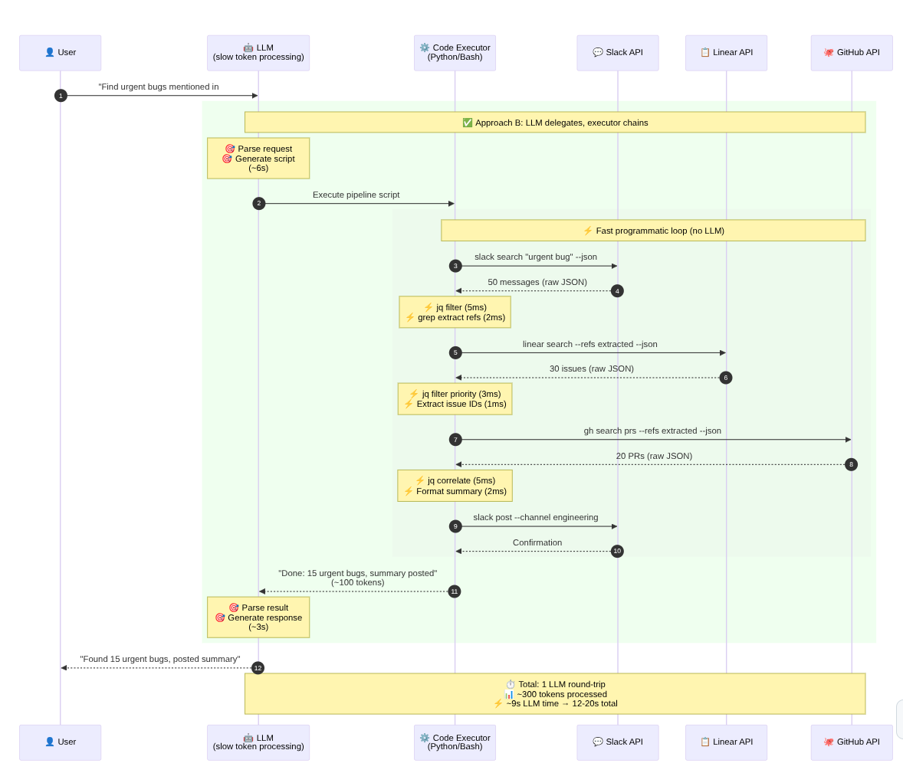

# MCP Considered Suboptimal (A technical analysis — not a software project)

**Premise:** Anthropic's Model Context Protocol (MCP) bloats context windows and makes LLMs dumber. Better alternative: give LLMs CLI tools they can script.

**Quick reference:** [Core Thesis](THESIS.md) — concise summary to share

---

## The Smoking Gun

In November 2025, Anthropic published a blog post effectively admitting MCP doesn't scale:

> **150,000 → 2,000 tokens. A 98.7% reduction.**

Their solution? Have agents write code instead of calling MCP tools directly.

Source: [Code Execution with MCP](https://www.anthropic.com/engineering/code-execution-with-mcp) (archived: [local copy](archived-resources/anthropic--code-execution-with-mcp.md))

**And it doesn't stop there.** Anthropic's own [Claude Code plugin marketplace](https://github.com/anthropics/claude-plugins-official/blob/261ce4fba4f2c314c490302158909a32e5889c88/.claude-plugin/marketplace.json#L643C1-L652C6) hosts Firecrawl's integration — which wraps a **CLI tool via a Skill**, not an MCP server. Firecrawl maintains [both MCP and CLI](https://github.com/firecrawl/.github/blob/eac6d8b43e11e1cc401a48e0e038a3c60fb53db9/profile/README.md) options. They chose CLI. ([details](ramblings/2026-02-18--firecrawl-claude-marketplace-cli-over-mcp.md))

---

## The Core Insight

> "Models do not get smarter when you give them more tools. They get smarter when you give them a small subset of really good tools."
> — Theo, t3.gg ([video transcript](archived-resources/theo-t3gg--anthropic-admits-mcp-sucks--transcript.md))

**MCP's Fourfold Problem:**

| Issue | Impact |
|-------|--------|
| **Cost** | More tokens = higher API bills |
| **Quality** | Context saturation → distracted model → worse outputs |
| **Latency** | More tokens = slower responses |
| **Compounding** | Wrong decisions → more steps → error cascades → recovery loops |

**Compounding is worst:** One bad tool choice leads to retries, exploration, 5 steps becoming 15.

---

## The Alternative: UNIX-Philosophy CLI Tools

Not just "any CLI" — tools built for composability and agent workflows:

| Principle | Implementation | Benefit |
|-----------|----------------|---------|
| **KISS** | 3-5 focused operations | Less to load, less confusion |
| **JSON/JSONL output** | `--json` flag, machine-readable | Filter BEFORE hitting context |
| **Self-documenting** | `--help` / `usage` command | Load docs on demand, not upfront |
| **Shell-first** | Standard CLI, no special protocol | Works with any bash-capable agent |
| **Composable** | Pipes to [`jq`][jq], [`rg`][ripgrep], scripts | Chain tools, filter locally |
| **Pre-trained** | bash, git, grep already known | Zero protocol overhead |

> "Standard CLI tool callable from bash (...) `usage` command provides complete documentation—agents self-document by reading output (...) Output JSON for piping to `jq` (...) Unix philosophy of small, composable tools (...) Leverage existing Bash tool instead of creating new tool type (...) Solve the problems you actually encounter."
> — Carlo Zottmann, Linearis design principles ([archived](archived-resources/zottmann--linearis-linear-cli-built.md))

**Result:** Data stays in sandbox. Tokens stay minimal. Code is deterministic.

**Detailed analysis:** [CLI/SDK Over Context Bloat](cli-sdk-over-context-bloat.md)

<table>
<tr>
<td></td>
<td></td>
</tr>
<tr>
<td align="center"><em>Approach A: Direct MCP (high latency)</em></td>
<td align="center"><em>Approach B: Executor Delegation (low latency)</em></td>
</tr>
</table>

*Click images for [detailed latency analysis](time-travel-latency.md)*

---

## Key Numbers

| Metric | Value | Source |
|--------|-------|--------|
| Token reduction (code exec vs MCP) | **98.7%** | Anthropic |
| MCP servers with production features | **~2%** | HackerNoon |
| Recommended max tools per agent | **3-5** | Industry consensus |
| Linear MCP server token cost | **~13,000** | Linearis author |
| Equivalent CLI token cost | **~200** | Linearis author |

---

## Featured Quotes

**On Context Efficiency:**

> "LLMs aren't traditional software systems where more data equals better decisions. They're pattern-matching machines. Every token in context adds noise."
> — HackerNoon ([archived](archived-resources/hackernoon--98-percent-mcp-servers-wrong.md))

**On Software Industrialization:**

> "Technical debt is the pollution of the digital world, invisible until it chokes the systems that depend on it. In an era of mass automation, we may find that the hardest problem is not production, but stewardship. **Who maintains the software that no one owns?**"
> — Chris Loy ([archived](archived-resources/chrisloy--rise-of-industrial-software.md))

**On MCP's Design Flaws:**

> "Did you know MCP has no concept of OAuth at all? At all. Now, there's like 18 implementations of it because there's no way to do proper handshakes."
> — Theo, t3.gg

**On Practical Alternatives:**

> "Token budget matters: 13k tokens for tool definitions is prohibitive. Simplicity wins: 3-4 features beats 20+ for real workflows."
> — Carlo Zottmann, Linearis ([archived](archived-resources/zottmann--linearis-linear-cli-built.md))

**On Choosing CLI Over MCP (from Anthropic's own marketplace):**

> "This plugin adds the Firecrawl CLI as a skill to Claude Code"
> — [Firecrawl Claude Plugin](https://github.com/firecrawl/firecrawl-claude-plugin/blob/684b975c8cc6bd0fcfa96f787900bf87fffeef57/README.md) (hosted in [Anthropic's official marketplace](https://github.com/anthropics/claude-plugins-official/blob/261ce4fba4f2c314c490302158909a32e5889c88/.claude-plugin/marketplace.json#L643C1-L652C6) — despite Firecrawl having an MCP server available)

**On Who Controls Context:**

> "MCP browser tools have a fundamental problem: **the server controls what enters your context**. With Playwright MCP, every response includes the full accessibility tree plus console messages. After a few page queries, your context window is full. CLI flips this around: **you control what enters context**."
> — [webctl](https://github.com/cosinusalpha/webctl)

---

## Further Reading

* **[Core Thesis](THESIS.md)** — Concise summary of the argument (shareable)
* **[Why This Repo?](WHY_THIS_REPO.md)** — Use cases, audiences, share templates
* **[Time-Traveling RPC for LLM Executors](time-travel-latency.md)** — Why executors beat MCP (latency analysis with diagrams)
* **[MCP Alternatives](mcp-alternatives.md)** — CLI tools that replace MCP servers (contribute yours!)
* **[FAQ: MCP Alternatives & Advanced Patterns](FAQ.md)** — Aggregators, sandboxing, self-optimization
* **[MCP Critique: Sources & Commentary](mcp-critique-sources.md)** — Comprehensive collection of industry voices
* **[Firecrawl: CLI Over MCP in Anthropic's Marketplace](ramblings/2026-02-18--firecrawl-claude-marketplace-cli-over-mcp.md)** — Case study with permalinks

---

## The Argument in Brief

1. **MCP bloats context** — 500+ tool definitions make models dumber
2. **Code execution works** — 98.7% token savings prove it
3. **CLIs are self-documenting** — `--help` on demand, not upfront
4. **Scripts are deterministic** — No hallucination in execution
5. **Executors minimize latency** — Keep LLMs out of fast loops ([details](time-travel-latency.md))
6. **Industrialization needs stewardship** — Generic tools, custom composition
7. **Software engineering patterns apply** — APIs > Protocols
8. **The market converges on CLI** — Even in Anthropic's own marketplace, CLI plugins over MCP ([evidence](ramblings/2026-02-18--firecrawl-claude-marketplace-cli-over-mcp.md))

---

## Call to Action

When building for LLM agents:

1. **Prefer CLI/SDK tools** over MCP servers
2. **Expose `--help`** or `usage` commands
3. **Output JSON** for composability
4. **Limit scope** to 3-5 core operations
5. **Let agents script** their own workflows

The future is not bigger context windows. It's smarter tool design.

---

## Primary Sources

* **Anthropic Engineering Blog:** [Code Execution with MCP](https://www.anthropic.com/engineering/code-execution-with-mcp) (Nov 2025) ([archived](archived-resources/anthropic--code-execution-with-mcp.md))
* **Anthropic Marketplace:** [Firecrawl CLI plugin](https://github.com/anthropics/claude-plugins-official/blob/261ce4fba4f2c314c490302158909a32e5889c88/.claude-plugin/marketplace.json#L643C1-L652C6) — Skill+CLI chosen over MCP in Anthropic's own repo (Feb 2026) ([analysis](ramblings/2026-02-18--firecrawl-claude-marketplace-cli-over-mcp.md))
* **Theo t3.gg:** [Anthropic admits they were wrong about MCP](https://www.youtube.com/watch?v=1piFEKA9XL0) (Nov 2025) ([archived](archived-resources/theo-t3gg--anthropic-admits-mcp-sucks--transcript.md))
* **HackerNoon:** [98% of MCP Servers Got This Wrong](https://hackernoon.com/98percent-of-mcp-servers-got-this-wrong-the-reason-why-the-protocol-never-worked) (Nov 2025) ([archived](archived-resources/hackernoon--98-percent-mcp-servers-wrong.md))
* **Chris Loy:** [The Rise of Industrial Software](https://chrisloy.dev/post/2025/12/30/the-rise-of-industrial-software) (Dec 2025) ([archived](archived-resources/chrisloy--rise-of-industrial-software.md))
* **Carlo Zottmann:** [Linearis: CLI Built for Agents](https://zottmann.org/2025/09/03/linearis-my-linear-cli-built.html) (Sep 2025) ([archived](archived-resources/zottmann--linearis-linear-cli-built.md))
* **Dev.to:** [Beyond the Hype: MCP Limitations](https://dev.to/ramkey982/beyond-the-hype-understanding-the-limitations-of-anthropics-model-context-protocol-for-tool-48kk) ([archived](archived-resources/devto--beyond-hype-mcp-limitations.md))
* **Simon Willison:** [Code Execution with MCP Commentary](https://simonwillison.net/2025/Nov/4/code-execution-with-mcp/) (Nov 2025) ([archived](archived-resources/simonwillison--code-execution-mcp-commentary.md))

---

*Archived 2026-01-23. All sources preserved with full attribution in `archived-resources/`.*

[jq]: https://github.com/jqlang/jq
