# Time-Travel Latency: Why Executor-Based Flows Beat Direct MCP Calls

**TL;DR:** Inspired by [Cap'n Proto's time-traveling RPC](https://capnproto.org/rpc.html), this document shows why LLMs should delegate fast, programmable logic to executors instead of making every API call themselves.

---

## The Cap'n Proto Insight

Cap'n Proto's ["time-travel" pattern](https://capnproto.org/images/time-travel.png) demonstrates a key RPC optimization:

> When Client needs data from Server3 (via Server2), it shouldn't wait for round-trips. Instead, Client sends a "promise" through Server2, which chains the calls immediately. The result comes back faster because Server2 doesn't wait for Client's permission at each step.

**The LLM equivalent:** When an LLM needs to make multiple API calls with logic in between, it shouldn't process all responses token-by-token. Instead, delegate the chaining to a fast executor.

---

## The Problem: LLM-in-the-Loop Latency

**Scenario:** LLM needs to query a database, filter results, fetch details for each item, and return a summary.

### Approach A: Direct MCP Tool Calls

```mermaid
sequenceDiagram
    autonumber
    participant L as LLM<br/>(slow token processing)
    participant M as MCP Server

    rect rgba(255,200,200,0.3)
    note over L,M: Approach A: LLM makes every call directly
    
    L->>M: Call #1: query_database(filter)
    M-->>L: Response: 5000 tokens (all matching records)
    note over L: 🐌 Parse 5000 tokens<br/>🐌 Reason about next step<br/>🐌 Generate next call<br/>(~10-30 seconds)
    
    L->>M: Call #2: get_details(item_1)
    M-->>L: Response: 2000 tokens
    note over L: 🐌 Parse 2000 tokens<br/>🐌 Decide next action<br/>(~5-15 seconds)
    
    L->>M: Call #3: get_details(item_2)
    M-->>L: Response: 2000 tokens
    note over L: 🐌 Parse 2000 tokens<br/>(~5-15 seconds)
    
    L->>M: Call #4: get_details(item_3)
    M-->>L: Response: 2000 tokens
    note over L: 🐌 Parse 2000 tokens<br/>🐌 Synthesize final answer<br/>(~10-20 seconds)
    end
    
    note over L,M: Total: 4 LLM round-trips<br/>~11,000 tokens processed<br/>~30-80 seconds latency
```



**Problems:**
- **Token overhead:** LLM must ingest 11,000+ tokens sequentially
- **Serial bottleneck:** Each call waits for LLM to think, generate response, think again
- **Wasted intelligence:** LLM spends cycles on mechanical filtering/parsing
- **Cost explosion:** Every token goes through expensive inference

---

## The Solution: Executor-Based Flow

### Approach B: LLM → Executor → Server

```mermaid
sequenceDiagram
    autonumber
    participant L as LLM<br/>(slow token processing)
    participant E as Logic Executor<br/>(Python/JS/Bash)
    participant S as Destination Server<br/>(API/DB/MCP)

    rect rgba(200,255,200,0.3)
    note over L,S: Approach B: Executor chains calls programmatically
    
    L->>E: High-level task:<br/>"Get top 3 items by score,<br/>fetch details, return summary"
    note over L: LLM yields control<br/>(not blocking)
    
    rect rgba(230,230,230,0.2)
    note over E,S: ⚡ Fast programmatic loop (no LLM)
    
    E->>S: query_database(filter)
    S-->>E: 5000 tokens (raw data)
    note over E: ⚡ Parse JSON (milliseconds)<br/>⚡ Filter top 3 by score<br/>⚡ Extract IDs [1, 2, 3]
    
    par Parallel requests
        E->>S: get_details(item_1)
        E->>S: get_details(item_2)
        E->>S: get_details(item_3)
    end
    
    par Parallel responses
        S-->>E: 2000 tokens
        S-->>E: 2000 tokens
        S-->>E: 2000 tokens
    end
    
    note over E: ⚡ Join results<br/>⚡ Extract relevant fields<br/>⚡ Format compact summary
    end
    
    E-->>L: Compact summary:<br/>300 tokens (only what LLM needs)
    note over L: 🎯 Process 300 tokens<br/>🎯 Generate final response<br/>(~2-5 seconds)
    end
    
    note over L,S: Total: 1 LLM round-trip<br/>~300 tokens processed by LLM<br/>~5-15 seconds latency
```



**Benefits:**
- **Token compression:** 11,000 → 300 tokens for LLM (97% reduction)
- **Parallel execution:** Executor can fetch multiple items simultaneously
- **Fast operations:** Parsing, filtering, joining happen at code speed (not inference speed)
- **Cost efficiency:** LLM only processes final summary
- **Latency win:** Single LLM round-trip vs. 4+

---

## Visual Comparison: Where Time Goes

### Approach A: LLM-in-the-Loop

```
Timeline (seconds):
0     10    20    30    40    50    60    70    80
|═════|═════|═════|═════|═════|═════|═════|═════|

█████████████ LLM processing call #1 response
              ████████ LLM processing call #2 response
                       █████ LLM processing call #3 response
                              ████████████ LLM processing call #4 response

▓ = LLM token processing (slow, expensive)
░ = Network/API call (fast, cheap)
```

**Breakdown:**
- 🐌 LLM token processing: ~60-70 seconds
- ⚡ Network/API calls: ~10-20 seconds

---

### Approach B: Executor-Based

```
Timeline (seconds):
0     10    20    30    40    50    60    70    80
|═════|═════|═════|═════|═════|═════|═════|═════|

░░░░░░░░░░ Executor loop (fast)
          ███ LLM final processing

▓ = LLM token processing (slow, expensive)
░ = Executor + network (fast, cheap)
```

**Breakdown:**
- 🐌 LLM token processing: ~2-5 seconds
- ⚡ Executor + network: ~5-10 seconds

**Latency reduction:** 70-80s → 10-15s (**80-85% faster**)

---

## The "Time-Travel" Analogy

In Cap'n Proto's time-travel RPC:
- Client sends a **promise** that Server2 can immediately pass to Server3
- Server2 doesn't wait for Client confirmation—it "predicts" the next call
- Result: fewer round-trips through slow network hops

In the LLM version:
- LLM sends a **high-level intent** that Executor can decompose
- Executor doesn't wait for LLM confirmation—it executes programmatic logic
- Result: fewer round-trips through slow token processing

**Both patterns optimize the same thing:** Keep slow actors (network latency / LLM inference) out of fast decision loops.

---

## Real-World Impact: The 98.7% Token Reduction

Anthropic's [Code Execution with MCP](https://www.anthropic.com/engineering/code-execution-with-mcp) blog post (Nov 2025) demonstrated this exact pattern:

| Metric | Direct MCP Calls | Code Execution (Executor) | Improvement |
|--------|------------------|---------------------------|-------------|
| Tokens processed | 150,000 | 2,000 | **98.7% reduction** |
| Approach | LLM calls tools directly | LLM writes code, code calls tools | Executor pattern |

**The lesson:** Don't make LLMs do what code does better.

---

## When to Use Each Approach

### Use Direct MCP Calls When:
- ✅ Single, one-off queries
- ✅ Exploratory tasks where LLM needs to "see" all data
- ✅ User explicitly wants LLM to reason about raw responses

### Use Executor-Based Flow When:
- ✅ Multi-step workflows with known logic
- ✅ Filtering, aggregation, or transformation needed
- ✅ High-volume data that LLM doesn't need to see in full
- ✅ Performance/cost is critical
- ✅ Parallelizable operations

**Rule of thumb:** If a human would write a script for it, so should the LLM.

---

## Practical Implementations

### Option 1: LLM Writes Code (Anthropic's Approach)

```python
# LLM generates this code instead of making direct tool calls
import mcp_client

def fetch_top_items(filter_params):
    # Fast programmatic loop
    results = mcp_client.query_database(filter_params)
    top_3 = sorted(results, key=lambda x: x['score'], reverse=True)[:3]
    
    # Parallel fetching
    details = [mcp_client.get_details(item['id']) for item in top_3]
    
    # Compact summary for LLM
    return {
        'count': len(top_3),
        'titles': [d['title'] for d in details],
        'avg_score': sum(d['score'] for d in details) / len(details)
    }
```

**Pros:** Maximum flexibility, LLM can adapt logic dynamically  
**Cons:** Requires code execution sandbox, prompt engineering

---

### Option 2: Pre-Built Executor Tools

```bash
# CLI tool that encapsulates the pattern
$ fetch-and-summarize \
    --query "status:active" \
    --sort-by score \
    --limit 3 \
    --fields title,score \
    --output json

# Returns compact JSON instead of raw dumps
{"count": 3, "titles": [...], "avg_score": 8.5}
```

**Pros:** No sandbox needed, easier security model  
**Cons:** Less flexible than code generation

---

### Option 3: MCP Server with Executor Built-In

```json
// Tool definition with "executor mode"
{
  "name": "smart_query",
  "mode": "executor",
  "description": "Query database and auto-filter results",
  "parameters": {
    "intent": "High-level task description",
    "max_tokens_return": 500
  }
}
```

**Pros:** Keeps MCP ecosystem, adds executor layer  
**Cons:** Still requires MCP tool definition overhead

---

## Key Takeaways

1. **Latency is multi-dimensional:** Token processing is often the bottleneck, not network
2. **Executors compress both tokens and time:** Fewer round-trips, less data to process
3. **LLMs should orchestrate, not micromanage:** Delegate mechanical work to code
4. **The pattern is proven:** 98.7% token reduction in production systems
5. **"Time-travel" applies to LLMs:** Keep slow actors out of fast loops

---

## Further Reading

* **[THESIS.md](THESIS.md)** — Core argument about MCP context bloat
* **[cli-sdk-over-context-bloat.md](cli-sdk-over-context-bloat.md)** — Detailed analysis of token efficiency
* **[FAQ.md](FAQ.md)** — Aggregators, sandboxing, and self-optimization patterns
* **[Cap'n Proto Time-Travel RPC](https://capnproto.org/rpc.html)** — Original RPC optimization pattern
* **[Anthropic: Code Execution with MCP](https://www.anthropic.com/engineering/code-execution-with-mcp)** — Real-world case study

---

*Part of [MCP Considered Suboptimal](https://github.com/kb4ai/mcp-considered-suboptimal-pub-kb)*
