# Time-Traveling RPC for LLM Executors

**The Cap'n Proto insight applied to AI agents:** Keep slow actors (LLM token processing) out of fast decision loops (API chaining, filtering, aggregation).

---

## The Cap'n Proto Principle

[Cap'n Proto's time-traveling RPC](https://capnproto.org/rpc.html) achieves low latency by eliminating round trips. Instead of:

```
Client → Server → Client → Server → Client
```

It batches operations so dependent calls execute without returning to the caller:

```
Client → Server (chains internally) → Client
```

**The same principle applies to LLM tool execution.**

---

## The Problem: LLM as Bottleneck

When an LLM makes sequential MCP tool calls, each round trip requires:

1. **Tool result → LLM context** (tokens in)
2. **LLM processing** (inference latency)
3. **LLM decision → next tool call** (tokens out)

This creates a fundamental latency bottleneck: **the LLM sits in every decision loop**, even for deterministic operations that don't require intelligence.

---

## Visual Comparison

*Note: All latency and token numbers below are illustrative examples to demonstrate the principle. Actual values vary by model, context size, API response times, and workload.*

### Approach A: Direct MCP Calls (LLM in the Loop)

```mermaid
sequenceDiagram
    autonumber
    participant U as 👤 User
    participant L as 🤖 LLM<br/>(slow token processing)
    participant S as 💬 Slack API
    participant R as 📋 Linear API
    participant G as 🐙 GitHub API

    U->>L: "Find urgent bugs mentioned in #engineering"

    rect rgba(255,200,200,0.3)
    note over L,G: ❌ Approach A: LLM processes every response

    note over L: 🐌 Parse request<br/>🐌 Plan first call<br/>(~6s)
    L->>S: MCP: slack.search("urgent bug")
    S-->>L: 50 messages (3,000 tokens)

    note over L: 🐌 Parse 3,000 tokens<br/>🐌 Extract keywords<br/>🐌 Decide next call<br/>(~15s)
    L->>R: MCP: linear.search(extracted_keywords)
    R-->>L: 30 issues (4,000 tokens)

    note over L: 🐌 Parse 4,000 tokens<br/>🐌 Extract issue refs<br/>🐌 Decide next call<br/>(~15s)
    L->>G: MCP: github.search(issue_refs)
    G-->>L: 20 PRs (2,500 tokens)

    note over L: 🐌 Parse 2,500 tokens<br/>🐌 Correlate all data<br/>🐌 Generate summary<br/>(~15s)
    L->>S: MCP: slack.post(summary)
    S-->>L: Confirmation (100 tokens)

    note over L: 🐌 Parse confirmation<br/>🐌 Generate response<br/>(~9s)
    end

    L-->>U: "Posted summary to #engineering"

    note over L,G: ⏱️ Total: 4 LLM round-trips<br/>📊 ~11,000 tokens processed<br/>🐌 ~60s LLM time → 1.5-4 min total
```



**Totals:**
- **Round trips:** 4 (each through LLM)
- **Tokens processed:** ~11,000
- **LLM processing time:** ~60 seconds (with large context window)
- **Total latency:** 1.5-4 minutes (depending on model/load)

### Approach B: Executor Delegation (LLM out of the Loop)

```mermaid
sequenceDiagram
    autonumber
    participant U as 👤 User
    participant L as 🤖 LLM<br/>(slow token processing)
    participant E as ⚙️ Code Executor<br/>(Python/Bash)
    participant S as 💬 Slack API
    participant R as 📋 Linear API
    participant G as 🐙 GitHub API

    U->>L: "Find urgent bugs mentioned in #engineering"

    rect rgba(200,255,200,0.3)
    note over L,G: ✅ Approach B: LLM delegates, executor chains

    note over L: 🎯 Parse request<br/>🎯 Generate script<br/>(~6s)
    L->>E: Execute pipeline script

    rect rgba(230,230,230,0.2)
    note over E,G: ⚡ Fast programmatic loop (no LLM)

    E->>S: slack search "urgent bug" --json
    S-->>E: 50 messages (raw JSON)
    note over E: ⚡ jq filter (5ms)<br/>⚡ grep extract refs (2ms)

    E->>R: linear search --refs extracted --json
    R-->>E: 30 issues (raw JSON)
    note over E: ⚡ jq filter priority (3ms)<br/>⚡ Extract issue IDs (1ms)

    E->>G: gh search prs --refs extracted --json
    G-->>E: 20 PRs (raw JSON)
    note over E: ⚡ jq correlate (5ms)<br/>⚡ Format summary (2ms)

    E->>S: slack post --channel engineering
    S-->>E: Confirmation
    end

    E-->>L: "Done: 15 urgent bugs, summary posted"<br/>(~100 tokens)

    note over L: 🎯 Parse result<br/>🎯 Generate response<br/>(~3s)
    end

    L-->>U: "Found 15 urgent bugs, posted summary"

    note over L,G: ⏱️ Total: 1 LLM round-trip<br/>📊 ~300 tokens processed<br/>⚡ ~9s LLM time → 12-20s total
```



**Totals:**
- **LLM round trips:** 1
- **Tokens processed:** ~300 (plan + confirmation)
- **LLM processing time:** ~9 seconds (with large context window)
- **Total latency:** 12-20 seconds

---

## The Math

*Illustrative example — actual numbers depend on model, context, and workload:*

| Metric | MCP (LLM in loop) | Executor (LLM out of loop) | Improvement |
|--------|-------------------|---------------------------|-------------|
| LLM round trips | 4 | 1 | **75% fewer** |
| Tokens processed | 11,000 | 300 | **97% reduction** |
| LLM inference time | ~60s | ~9s | **85% faster** |
| Total latency | 1.5-4 min | 12-20s | **85-92% faster** |
| API cost (at $3/1M tokens) | $0.033 | $0.0009 | **97% cheaper** |

---

## Why This Matters for Agents

### Latency Compounds in Agentic Loops

In autonomous workflows, agents often iterate:

```
Plan → Execute → Evaluate → Adjust → Execute → ...
```

If each "Execute" step involves 4 LLM round trips instead of 1, a 10-step workflow becomes:

- **MCP approach:** 40 LLM round trips, 110,000 tokens
- **Executor approach:** 10 LLM round trips, 3,000 tokens

**The gap widens with complexity.**

### Quality Degrades with Context Size

As documented in [THESIS.md](THESIS.md), more tokens in context means:

- Diluted attention across irrelevant data
- "Lost in the middle" phenomenon
- Higher hallucination rates
- Slower inference

By keeping intermediate results out of LLM context, executors preserve model quality for decisions that actually require intelligence.

---

## Implementation Pattern

```python
# MCP approach: LLM sees everything
async def mcp_workflow(llm, query):
    # Round trip 1: Search Slack
    slack_results = await llm.call_tool("slack.search", query)  # 3,000 tokens

    # Round trip 2: Search Linear (LLM extracts keywords)
    keywords = await llm.extract_keywords(slack_results)  # LLM processing
    linear_results = await llm.call_tool("linear.search", keywords)  # 4,000 tokens

    # Round trip 3: Search GitHub (LLM extracts refs)
    refs = await llm.extract_refs(linear_results)  # LLM processing
    github_results = await llm.call_tool("github.search", refs)  # 2,500 tokens

    # Round trip 4: Post summary (LLM generates)
    summary = await llm.generate_summary(slack_results, linear_results, github_results)
    await llm.call_tool("slack.post", summary)  # 100 tokens


# Executor approach: LLM plans, executor runs
async def executor_workflow(llm, query):
    # Single LLM round trip: generate execution plan
    plan = await llm.generate_plan(query)  # ~200 tokens

    # Executor runs without LLM intervention
    result = await executor.run("""
        slack search "urgent bug" --json | jq '.[] | .text' > /tmp/slack.txt
        grep -oE '[A-Z]+-[0-9]+' /tmp/slack.txt | sort -u > /tmp/refs.txt

        linear search --refs $(cat /tmp/refs.txt) --json | \
            jq '.[] | {id, title, priority}' > /tmp/issues.json

        gh search prs --json --refs $(cat /tmp/refs.txt) > /tmp/prs.json

        # Format summary locally (no LLM needed for formatting)
        jq -s '{issues: .[0], prs: .[1]}' /tmp/issues.json /tmp/prs.json | \
            slack post --channel engineering --format summary
    """)

    # Single confirmation back to LLM
    return f"Done: {result.summary}"  # ~100 tokens
```

---

## The Principle

> **Keep slow actors out of fast loops.**

| Actor | Speed | Role |
|-------|-------|------|
| LLM inference | Slow (~3-15s per call with context) | High-level planning, ambiguity resolution |
| Code execution | Fast (~10-100ms) | Data transformation, filtering, API chaining |
| API calls | Medium (~100-500ms) | External data retrieval |

**MCP puts the slow actor (LLM) in every loop. Executors keep it where it belongs: making intelligent decisions, not shuffling data.**

---

## Related Concepts

- **Cap'n Proto Time-Traveling RPC** — The original insight about minimizing round trips
- **Continuation-Passing Style** — Passing "what to do next" rather than returning intermediate results
- **Dataflow Programming** — Operations chain without central coordination
- **Unix Pipes** — Data flows through transformations without returning to shell

---

## Further Reading

- [THESIS.md](THESIS.md) — Core argument for CLI/SDK over MCP
- [cli-sdk-over-context-bloat.md](cli-sdk-over-context-bloat.md) — Detailed patterns for executor-style workflows
- [FAQ.md](FAQ.md) — Agent self-optimization patterns
- [Cap'n Proto RPC](https://capnproto.org/rpc.html) — Original time-traveling RPC documentation

---

*Part of [MCP Considered Suboptimal](https://github.com/kb4ai/mcp-considered-suboptimal-pub-kb)*
